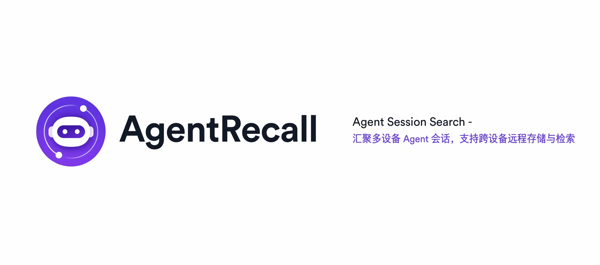
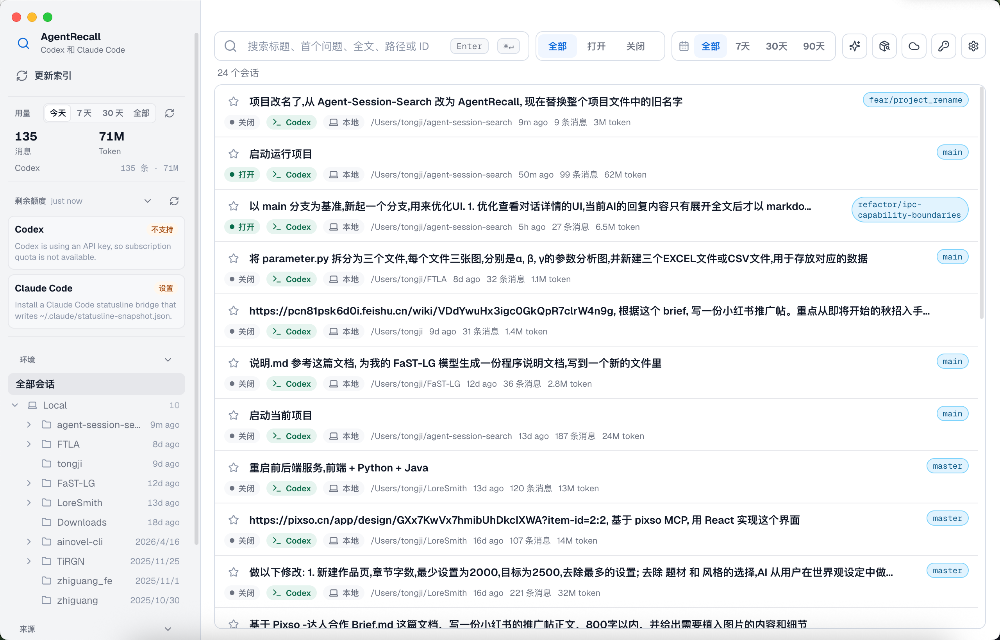
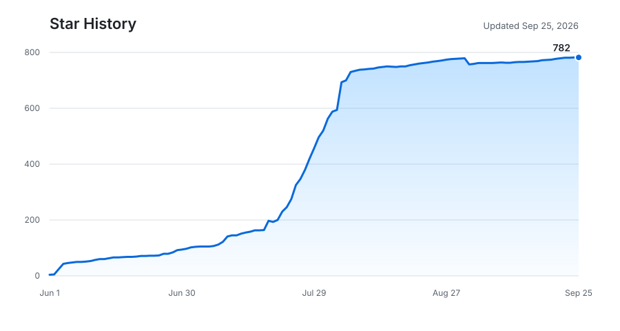

<p align="center">
  
</p>

<h1 align="center">AgentRecall</h1>

<p align="center">本地桌面工具 · 搜索、查看、恢复 AI Coding Agent 会话</p>

<p align="center">
  简体中文 ｜ <a href="./docs/README.en.md">English</a>
</p>

<p align="center">
  
  
  
  
  <a href="https://github.com/zszz3/AgentRecall/stargazers"></a>
  <a href="./LICENSE"></a>
</p>

<p align="center">
  
</p>

AgentRecall 用来集中管理分散在不同 AI Coding Agent 中的会话。你可以搜索历史对话、查看完整上下文、整理重要记录，也可以继续、迁移或跨设备恢复会话。

仓库中同时维护 v1 和 v2。两个版本使用独立的命令、应用数据和数据库，可以同时运行，但不会自动共享或导入数据。

## 选择版本

| 版本 | 适合的使用方式 | 启动入口 |
| --- | --- | --- |
| AgentRecall v1 | 安装后直接管理本机及远程环境中的 Agent 会话 | `agent-recall` |
| AgentRecall v2（预览版） | 在会话管理之外使用工作台、Chat、Workflow、Eval、Runtime 和目录记忆等功能 | `agent-recall-v2` |

## AgentRecall v1

### 功能

- **搜索和整理会话**：统一索引 Claude Code、Codex 以及已启用的可选来源，支持关键词、环境、项目、来源、标签、收藏、隐藏状态和时间范围筛选，也可以保存常用搜索条件。
- **查看完整上下文**：在详情页查看消息、Markdown、代码块、工具事件和附件；会话内可以继续查找关键词，并按用户或助手消息缩小范围。
- **继续、迁移和导出**：从搜索结果 Resume 原会话，在支持的本地 Agent 之间迁移，也可以导出 Markdown、纯文本或常见模型请求格式的 JSON。
- **扩展会话来源**：Claude Code 和 Codex 默认启用。CodeBuddy、WorkBuddy、CodeWiz、TClaude、TCodex、OpenClaw、Hermes、OpenCode、ZCode、Cursor Agent、Trae、Qoder 需要在 **设置 → 可选来源** 中开启。WorkBuddy 首版仅支持本地搜索、查看和导出消息、工具轨迹、标题及用量信息，不支持实时跟踪、Resume、迁移、同步或从 AgentRecall 打开 WorkBuddy。Windows WSL 和 SSH 环境可以单独添加。
- **AI 辅助检索**：为会话生成摘要，或用自然语言描述想找的内容。摘要和 AI 找会话使用你在 Provider 中选择的 Codex、Claude Code 或自定义接口。
- **跨设备同步**：使用自己的 Supabase 项目手动上传会话，或为 Claude Code、Codex 安装同步 Hooks。在另一台设备上可以搜索、查看和恢复云端会话。
- **Skills 与数字资产**：查看和管理本机 Skills，并在多台设备间同步 Skills、Rules 和 Memories。云端版本可以预览、安装或恢复。
- **MCP、用量和额度**：让 Claude Code、Codex、CodeBuddy 等通过 MCP 搜索和整理历史会话；工作台还会统计 Token 用量，并显示 Claude Code、Codex 的额度状态。

### 安装与启动

准备 Node.js 22.13 或更高版本，然后安装最新 Release：

```bash
npm install -g https://github.com/zszz3/AgentRecall/releases/latest/download/agent-recall.tgz
agent-recall
```

也可以把下面这段话直接贴给你的 AI Agent（Claude Code、Codex 等），让它帮你安装：

> 请帮我安装 AgentRecall：先确认 Node.js 22.13 或更高版本可用，然后执行 `npm install -g https://github.com/zszz3/AgentRecall/releases/latest/download/agent-recall.tgz`。如果 npm 或 Electron 下载缓慢，追加 `--registry=https://registry.npmmirror.com` 并设置环境变量 `ELECTRON_MIRROR=https://npmmirror.com/mirrors/electron/` 后重试。安装完成后运行 `agent-recall` 确认能正常启动；遇到问题请阅读 https://github.com/zszz3/AgentRecall/blob/main/Install.md 排查。

| 系统 | 启动命令 | 默认快捷键 |
| --- | --- | --- |
| macOS | `agent-recall` | `⌥ Option + Space` |
| Windows | `agent-recall` | `Ctrl + Alt + Space` |

启动后应用会常驻菜单栏或系统托盘，设置、主题、语言和快捷键都可以在应用内调整。macOS 上执行 `agent-recall install-app` 可以生成本地 `AgentRecall.app`，之后直接从 Launchpad / Spotlight / Dock 打开。更新执行 `agent-recall --update` 即可；完整安装、更新、回滚、卸载和国内镜像说明见 [Install.md](./Install.md)。

> 更详细的使用说明请查看 [AgentRecall v1 Guide](./docs/v1/guide.md)。

## AgentRecall v2（预览版）

v2 在会话管理、远程同步和用量统计之外，增加了可复用 Agent、多人 Chat、Workflow、Eval、MCP、目录记忆和 Skill 库。

### 功能

- **工作台和 Session**：查看用量、模型额度和最近活动，搜索、筛选并整理不同来源的会话；详情页支持会话内查找、Resume、迁移、导出、AI 摘要和远程恢复。
- **Runtime 和 Agent**：为 Codex、Claude Code、API、Hermes、OpenCode、OpenClaw 或 DeepSeek Harness 准备执行配置，再保存可复用 Agent，供 Chat、Workflow 和 Eval 使用。
- **多 Agent Chat**：创建共享项目目录的工作室，让多名员工保留独立上下文；通过 `@名称` 或接收者列表指定一个或多个 Agent 响应。
- **Workflow**：描述任务并回答规划 Agent 的追问，生成、Review 和确认流程图后运行 Agent 或脚本节点；运行期间可以处理追问、审批、产物和异常恢复。
- **Eval**：支持 skill 维度的 Eval 驱动优化闭环，用户可以自定义 good cases，支持 Case + LLM Judge 回归评测，逐 Case 评分和跨版本对⽐。
- **MCP**：为 Codex 和 Claude Code 连接一个 AgentRecall Gateway；常用的 Skill、Session 工具直接开放，其余 STDIO 或 HTTP MCP 工具通过渐进式索引按需查看和调用。
- **目录 Memory**：为主动选择的项目目录建立彼此隔离的长期记忆，只增量捕获开启后的新对话，维护手动记忆，并为 Codex、Claude Code 或 OpenCode 开启自动召回；历史会话继续通过 Session 搜索按需复用。
- **Skills 和 Provider**：查看本机 Skill 或从公共仓库发现 Skill，加入 Skill 库后安装到 Codex、Claude Code 等编码 Agent；Provider 页面单独管理本机 Codex、Claude Code 和会话 AI 功能使用的服务。

### 安装与启动

准备 Node.js 22.13 或更高版本，然后安装最新的 v2 Release：

```bash
npm install -g https://github.com/zszz3/AgentRecall/releases/download/v2-latest/agent-recall-v2.tgz
agent-recall-v2
```

| 系统 | 启动命令 | 默认快捷键 |
| --- | --- | --- |
| macOS | `agent-recall-v2` | `⌥ Option + Space` |
| Windows | `agent-recall-v2` | `Ctrl + Alt + Space` |

启动后应用会常驻菜单栏或系统托盘，并自动准备本地数据服务，不需要另外安装 PostgreSQL。macOS 上执行 `agent-recall-v2 install-app` 可以生成本地 `agent-recall-v2.app`，之后直接从 Launchpad / Spotlight / Dock 打开。更新执行 `agent-recall-v2 --update` 即可，App 内也可以在 **设置 → 关于** 检查更新。

v2 的命令、应用数据、数据库和更新缓存都与 v1 分开，默认不会自动读取 v1 数据；如需迁移，可在 **设置 → 关于 → V1 数据迁移** 中手动导入。两者可以同时安装并运行。连接 MCP 客户端时，v2 Gateway 使用统一的 `agent-recall` 入口。完整的安装、更新、回滚和卸载说明见 [Install.md](./Install.md)。

> 更详细的使用说明请查看 [AgentRecall v2 Guide](./docs/v2/guide.md)。

## 隐私与安全

- 会话索引与元数据保存在本机，不经过 AgentRecall 提供的第三方服务。
- 各 Agent 的原始会话文件只作为读取来源；恢复和迁移会创建新副本。
- 跨设备同步完全可选，使用你自己的 Supabase 项目。
- AI 摘要、AI 搜索和自动记忆会把相关内容交给你选择的 Provider；是否启用由你决定。
- AgentRecall 不收集遥测或使用数据，项目代码公开在本仓库。

## 参与贡献

欢迎提交 Issue 和 PR。本地开发：

```bash
git clone https://github.com/zszz3/AgentRecall.git
cd AgentRecall
npm run setup:v1
npm run dev:v1
```

开发 `agent-recall-v2` 时改用 `npm run setup:v2` 和 `npm run dev:v2`。Windows 上首次执行 `npm run setup:v2` 需要以管理员身份运行终端，以便准备内置 PostgreSQL 所需的符号链接。两个应用分别位于 `apps/main-1.0` 与 `apps/main-2.0`，根目录命令负责统一测试、类型检查和构建。

提交前请阅读 [CONTRIBUTING.md](./CONTRIBUTING.md)，并确保 `npm test`、`npm run typecheck` 与 `npm run release-note:check` 通过。

### Collaborators

<!-- readme: collaborators -start -->
<table>
	<tbody>
		<tr>
            <td align="center">
                <a href="https://github.com/Blue-Berrys">
                    
                    <br />
                    <sub><b>Blue-Berrys</b></sub>
                </a>
            </td>
            <td align="center">
                <a href="https://github.com/G-Pegasus">
                    
                    <br />
                    <sub><b>G-Pegasus</b></sub>
                </a>
            </td>
            <td align="center">
                <a href="https://github.com/zszz3">
                    
                    <br />
                    <sub><b>zszz3</b></sub>
                </a>
            </td>
            <td align="center">
                <a href="https://github.com/mesakurax">
                    
                    <br />
                    <sub><b>mesakurax</b></sub>
                </a>
            </td>
            <td align="center">
                <a href="https://github.com/LANSGANBS">
                    
                    <br />
                    <sub><b>LANSGANBS</b></sub>
                </a>
            </td>
            <td align="center">
                <a href="https://github.com/forbbiden1">
                    
                    <br />
                    <sub><b>forbbiden1</b></sub>
                </a>
            </td>
		</tr>
		<tr>
            <td align="center">
                <a href="https://github.com/MeloMei">
                    
                    <br />
                    <sub><b>MeloMei</b></sub>
                </a>
            </td>
		</tr>
	<tbody>
</table>
<!-- readme: collaborators -end -->

## Star History

<a href="https://www.star-history.com/?repos=zszz3%2FAgentRecall&type=date&legend=top-left">
  
</a>

## 开源协议

本项目基于 [MIT License](./LICENSE) 开源。

> [!NOTE]
> AgentRecall 是独立的开源项目，与 Anthropic、OpenAI、Cursor 等公司均无关联。Claude、Codex 等名称与商标归其各自所有者所有。

有任何问题，请提交 Issue。如果觉得项目对你有帮助，欢迎 Star。
