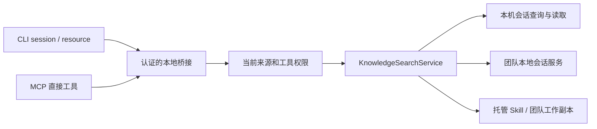

# 会话与资源检索契约

范围：V2 的 `KnowledgeSearchService`、CLI 查询入口与 MCP 直接工具。本文描述当前实现，不表示所有来源已提供相同搜索语义。V1 继续使用自己的会话 MCP 和 SQLite 索引，不读取 V2 团队副本。使用示例见[Agent 检索指南](../v2/agent-search.md)，设计取舍见 [ADR 0011](../adr/0011-separate-agent-search.md)。

## 调用链与所有权

CLI 不连接 PostgreSQL，也不解析原始 Agent 日志。服务复用已有索引和工作副本，不新建搜索数据库，不在查询过程中隐式 Pull 或补全远端正文。后续模型如何使用返回内容属于调用方行为。

| 所有者 | 责任 |
| --- | --- |
| [CLI 命令解析](../../apps/cli/src/cli.ts) | 校验命令支持的参数，转换为请求，检查最终终端输出大小 |
| [CLI 传输](../../apps/cli/src/search-client.ts) | 读取 V2 连接信息、认证请求、限制响应长度、释放响应 reader |
| [Automation 服务](../../apps/main-2.0/src/main/services/automation-service.ts) | 将查询接入桥接并执行来源和工具开关检查 |
| [检索服务](../../apps/main-2.0/src/main/services/knowledge-search-service.ts) | 严格解析输入、选择范围、验证团队引用、限制完整回复 |
| 会话 store / 团队服务 / workspace-core | 保有原数据和领域规则；检索层不直接维护另一份副本 |

## 范围与返回模型

| 操作 | 本机范围 | 团队范围 |
| --- | --- | --- |
| searchSessions | 转发 query、source、project、limit 到本机会话查询 | 调用指定团队的本地分享搜索，返回 page、hasMore、pageSize、items |
| getSession | 转发 sessionKey、offset、maxMessages，按消息读取 | 按分享版本选择 record，再读取轮次目录或指定 turnId |
| searchResources | 本机托管 Skill 条目 | 团队工作副本里的 Skill、文档、共享指令 |
| getResource | 用 id 与 type 定位正文 | 同时用团队范围、id 与 type 定位正文 |

会话与资源不混排；会话的本机响应沿用已有查询接口，不能假定它与团队 items 具有同样封装。团队搜索的一项是一份分享，match 可指向其中某个子会话的轮次；不得把它拆成多份虚构分享。

默认 scope 为 local。team 必须指定 teamId；local 带 teamId 会拒绝。团队会话不接受 source/project 筛选；本机会话不接受团队分页或 includeTools。分页方式与数值上限由 [CLI 参考](../v2/cli.md#分开搜索会话与资源)维护，调用方不能混用。

## 资源匹配与分页

资源查询 trim 后按空白分词，对标题、说明和完整正文拼接结果进行大小写不敏感的包含判断，所有词都必须匹配。它不是向量检索，不计算统一相关性分数；结果顺序沿用资源枚举顺序，调用方不能宣称第一项一定最相关。

搜索只返回 id、type、title、scope、teamId、description、snippet 以及 nextOffset，不直接返回完整 content。snippet 从正文中第一个查询词附近取片段；若命中只在标题或说明，正文片段不一定包含命中词。调用方应继续读取原文确认。

读取返回 content、totalChars、nextOffset。offset 按 JavaScript 字符串切片位置解释，不是 UTF-8 字节偏移或用户可见字形数量。后续分页使用返回的 nextOffset，不能用终端显示宽度自行推算。

当前分页没有冻结资源快照。分页期间内容变化时，调用方需要重新搜索和读取；不能将多次请求拼接后视为同一版本的强一致快照。资源大小、结果条数和回复字节数是不同边界。

## 团队会话引用

团队搜索返回的 sessionKey 使用 `shared:` 前缀，编码团队 ID、仓库、分享 ID 和摘要。它是定位信息，不是访问令牌，也不是可执行路径。

读取时重新解析引用并验证当前团队配置。仓库改变时拒绝旧引用；分享版本或本地准备状态由团队服务进一步校验。调用方应保留服务返回的完整键，不用标题、作者或列表序号替换。

record 默认为主会话。未提供 turnId 时读取对应记录的轮次目录；提供 turnId 时读取具体轮次。普通本机会话不接受 record/turnId 的团队定位语义。超大单轮仍受完整回复上限约束，没有以静默截断工具输出绕过限制的路径。

## 权限与传输

会话查询受会话工具源及搜索/读取工具开关控制；资源查询还需满足 Skills 来源及对应基础工具和资源工具的开关。CLI 复用服务端验证，不能因它不是 MCP 客户端而跳过权限。

CLI 读取 V2 的桥接发现文件，只接受 `127.0.0.1`、有效端口和规定格式的 token；不接受远程主机或 HTTP 重定向。连接信息损坏、应用未运行、连接失败或超时都返回错误。不要将该发现文件或 token 放入共享仓库。

检索不会列出 MCP/Env 配置，但文档、Skill 和会话正文自身可能包含敏感信息。限定资源类型不是通用脱敏器，也不构成对正文安全性的保证。

## 失败与兼容

| 条件 | 行为 |
| --- | --- |
| 未知字段、非法类型或分页参数 | schema 拒绝，不猜测用户意图 |
| 团队关闭、缺少团队 ID 或范围不匹配 | 拒绝对应查询，不自动切换到默认团队 |
| 分享未整理或版本不匹配 | 返回本地读取错误，由用户主动 Pull 或重新搜索 |
| 资源已删除 | 报资源不存在，要求重新搜索 |
| 完整回复超过限制 | 报错，不截掉尾部后标记成功 |
| 桌面未运行或连接信息无效 | CLI 提示启动或重启 V2 |

当前没有跨本机与多个团队的聚合搜索、资源语义排序、搜索驱动的自动安装，以及脱离 V2 的会话检索进程。添加这些能力需要明确新的范围和生命周期，不能作为一次查询的隐式副作用。

## 验证入口

[检索服务测试](../../apps/main-2.0/src/main/services/knowledge-search-service.test.ts)覆盖资源与会话分流、关键词匹配、正文分页、团队范围、旧仓库引用、非法参数及完整回复字节限制。[CLI 传输测试](../../apps/cli/test/search-client.test.ts)覆盖连接边界。服务测试存在不等于每个 Agent 客户端已经完成真实联调。

修改时优先保护：查询不联网同步、团队不可串读、关闭工具后不能通过 CLI 绕过、正文超限明确报错、分页参数不在本机与团队之间混用。示例和测试均使用合成内容，不读取开发者真实会话或凭据。
