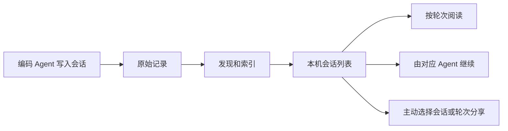

# V2 会话：索引、阅读与继续工作

本页解释同一段对话在 AgentRecall 中的不同用途。页面操作入口见[使用指南](guide.md#4-搜索查看和整理-session)，解析和持久化契约见[会话索引规格](../spec/session-indexing.md)。

## 先区分四份数据

| 数据 | 从哪里来 | 用途 |
| --- | --- | --- |
| Agent 原始会话 | Codex、Claude Code 等客户端 | 保留来源记录，供对应客户端继续会话 |
| 普通会话索引 | AgentRecall 读取已启用来源后生成 | 搜索、分页阅读、整理和关联会话 |
| 团队共享副本 | 主动分享，或 Pull 后在本机整理 | 离线阅读、检索和导出团队历史 |
| 导出后新建的会话 | 从共享副本或迁移操作生成 | 在选择的本地工作目录继续工作 |

普通索引与团队副本分别管理。团队有一份可读分享，不表示原作者的工作目录、依赖和附件文件也已在你的电脑上准备好。V2 的数据与 V1 隔离，不能通过切换应用来修复另一版的索引。

## 从新对话到可搜索

首次使用先确认来源已启用，再在 Session 页面更新索引。后续扫描会判断文件和派生规则是否变化；未变化文件通常可跳过正文解析。JSONL 分块读取、追加解析、只更新尾部轮次是三种不同能力，当前不能保证每一种来源和记录都只读尾部。精确适用范围见[索引行为](../spec/session-indexing.md#行为与数据流)。

索引完成后仍找不到会话时，先核对来源、执行环境、项目和日期筛选，再检查本轮索引是否报告失败。不要因为当前列表为空就删除原会话或重建全部数据。

## 阅读时为什么还有加载

列表、轮次目录、轮次正文按需读取。打开会话不等于已经加载所有工具输出；展开尚未读取的轮次仍需要从本机索引取正文。

V2 会暂存最近阅读的普通会话和 Turn。短时间内重新打开同一版本可先显示已有内容，再核对本地索引；正文超过缓存预算时仍能读取，只是不保留在这层缓存里。缓存不是备份，关闭窗口后不会保留。具体容量、有效期和失效条件见[阅读缓存](../spec/session-indexing.md#v2-会话阅读缓存)。

因此应分别判断：首次索引慢、列表查询慢、单轮正文大，还是分享尚未 Pull 完成。它们分别对应不同处理路径，排查方法见[性能说明](performance.md)。

## 继续、迁移与共享恢复如何选择

| 目标 | 使用什么 | 结果 |
| --- | --- | --- |
| 在原客户端继续本机会话 | Resume | 使用对应 Agent 的继续能力，取决于来源支持情况 |
| 把历史带到另一种受支持 Agent | 会话迁移 | 创建目标格式的新会话 |
| 阅读或留存团队对话 | 团队阅读、导出 MD/JSON | 获得阅读内容，不创建可 Resume 会话 |
| 从团队完整会话或片段继续 | 导出为 Session | 创建新的本机会话，再到 Session 页面 Resume |
| 保存分享包里的原文件与附件 | 下载分享包 | 保存归档包，不等于已在客户端注册会话 |

不同来源支持的操作不同，不能把一个 Agent 的 Resume 能力推广到所有来源。共享会话的四种操作有更细的[范围对照](team-collaboration.md#阅读下载和继续工作)。

## 大会话怎么处理

先决定要共享整段历史，还是只共享处理某个问题的轮次。单独分享 Turn 不会上传未选轮次，但选中轮次自身仍可能包含很大的工具输出或图片。

当前完整分享有包大小、解压大小和单文件限制，也仍会在内存中准备快照。压缩和去重不能保证任意大文件可上传；例如 500 MB 的原始会话不能据此承诺完整分享。精确限制只在[团队空间](team-workspace.md#共享会话)维护，遇到超限应缩小选择，不反复尝试同一份完整输入。

## 常见情况

| 看到的现象 | 先检查什么 |
| --- | --- |
| 今天使用过 Agent，但列表找不到 | 来源开关、环境与日期条件、本轮索引结果 |
| 列表有标题，展开仍在加载 | 该轮正文大小与本机读取；团队分享还要看 Pull 整理结果 |
| 关闭再开仍需等待 | 是否超过缓存有效期、文件版本是否变化、正文是否超过缓存预算 |
| 分享能阅读但不能直接 Resume | 先导出为 Session；确认来源支持恢复并选择工作目录 |
| 导出提示文件已创建但索引失败 | 先刷新列表核对，避免重复创建 |
| 团队片段缺少前面的背景 | 片段只含已分享轮次，不会自动补齐原会话 |
