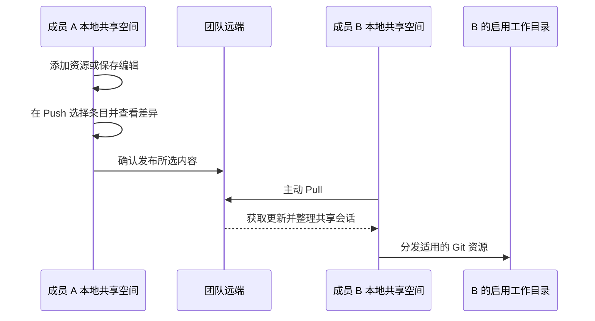

# V2 团队协作流程

团队是一个共享资产仓库的本机连接。工作目录决定资产安装到哪里，可以不是 Git 仓库；一个团队可以接入多个目录。连接方法、按钮与资源格式分别见[团队空间](team-workspace.md)和[团队资产参考](team-assets.md)。本页用两位成员的操作说明各阶段的结果。

## 第一次接入

1. 在设置中准备团队连接并开启团队功能。仓库权限沿用本机已有认证；保存连接不等于取得仓库权限。
2. 添加需要使用团队资产的工作目录，选择 Codex、Claude Code 或两者，并确认目录启用。
3. 主动 Pull，查看每个目录和资源的结果。冲突或失败时先处理对应条目，不把部分成功当成整轮完成。
4. 在团队空间检查本地资源；需要使用时，让客户端读取分发后的文件。普通文档不会仅因 Pull 就自动进入 Agent 上下文。

开启开关和接入目录不会自动上传个人文件。客户端的具体落盘位置统一见[同步写到哪里](team-workspace.md#同步写到哪里)。

## 成员 A 修改，成员 B 使用

A 保存后能立即在自己的共享空间看到修改，B 此时还看不到。A Push 成功后远端已有内容，B 仍需 Pull。A 自己的客户端工作目录也不会因为 Push 自动更新，需要 Pull 分发。

Skills、文档、共享指令、MCP、公共 Env 通过 Git 资产发布；完整会话与 Turn 使用独立分享附件。一次同时上传资源和会话可能部分成功，必须看逐项结果。分类文件夹只影响团队页面的组织，不改变客户端安装目录。

## 两个人都修改同一项

Push 比较本地保存内容与同步基准，最终发布前再核对远端。远端已经变化时，不能用旧预览覆盖另一位成员的更新。

遇到冲突，先 Pull 并查看本地差异，核对要保留的内容，再重新编辑保存或重新添加资源，重新预览后发布。Pull 保留尚未发布的本地修改；它不提供任意文件的自动三方合并。分发到工作目录时还会检查文件归属和本地修改，个人同名文件不会被自动接管。

完整规则见[冲突矩阵](../spec/team-assets.md#归属与冲突矩阵)。

## 分享会话或几个 Turn

从本地 Session 右键发起完整分享；只需要部分历史时，在详情页右键进入多选轮次。选择团队后，上传弹窗只选中本次内容，可以直接上传，也可以先看 Diff。关闭弹窗后，已加入的待上传项可在团队 Push 中找回。

上传者也有本地共享副本。上传成功不需要重新下载同一正文才能阅读；远端成功而本地整理失败时，应按提示 Pull 恢复，不重复发布。成员 B 首次 Pull 会下载并整理缺失内容，之后阅读、搜索和展开轮次使用本地副本。

分享不会自动脱敏。上传前检查选中的消息、工具输入输出及附件；公开仓库中的分享同样公开。撤回不能删除其他成员已经保存的副本，分块存储的清理边界见[共享会话说明](team-workspace.md#共享会话)。

## 阅读、下载和继续工作

| 操作 | 是否需要远端 | 得到什么 | 是否可直接 Resume |
| --- | --- | --- | --- |
| 阅读、搜索、展开轮次 | 本地整理完成后不需要 | 分享正文与工具记录 | 否 |
| 导出 MD / JSON | 不需要 | 可阅读或处理的本地索引内容 | 否 |
| 下载分享包 | 会访问远端 | 可独立保存的压缩分享包 | 不是创建客户端会话的操作 |
| 导出为 Session | 不需要远端读取 | 选择目录后新建的本机会话 | 到普通 Session 页继续 |

导出为 Session 支持完整分享和 Turn 片段。片段只恢复分享范围；工具记录成为带标记的历史文本，不重新执行；附件只保留名称，不恢复文件；子会话作为带标题的历史上下文合入。每次生成新的会话身份，原分享和原作者会话不变。

它适合“带着这段处理经验继续工作”，不保证恢复原机器的文件、进程、运行环境或全部附件。

## 操作失败后怎么继续

| 状态 | 下一步 |
| --- | --- |
| 保存到共享空间，但尚未上传 | 打开 Push，选择需要发布的项 |
| 预览过期或内容变化 | 重新预览，不复用旧确认 |
| 发布结果尚未确认 | 先同步核对远端，再决定是否重试 |
| 部分条目成功 | 保留成功结果，只处理剩余失败或取消项 |
| Pull 中途取消 | 已完成副本保留，再次 Pull 处理缺失内容 |
| 分享列表有条目但正文未就绪 | 查看同步结果，重新 Pull 整理 |
| 已导出会话但未进入列表 | 刷新普通会话索引，核对创建结果 |

关闭团队功能不等于卸载已分发文件，也不等于删除远端内容。停用、断开、撤回和卸载是不同操作，按对应页面的结果确认实际影响。
